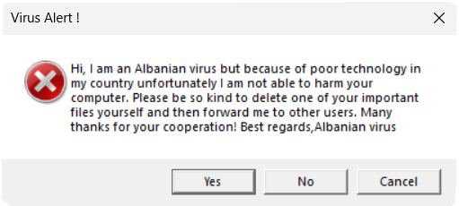

# Phish

This is just a simple test to see how small I could make a Rust binary that does something simple. The application just
shows a Windows messagebox alert. The file size optimizations were done by following the wonderful documentation over
at [min-sized-rust](https://github.com/johnthagen/min-sized-rust).

The current binary size is 1236 bytes. Going much smaller would likely require handwritten assembly. If that sounds
interesting to you, take a look at [Alexander Sotirov's Tiny PE writeup](http://www.phreedom.org/research/tinype/).

## Usage

~~This project is useless~~ there are many ways to use this project. Here's how I personally use it:

1. build the project
2. rename the binary to `virus.exe`
3. send it to your friends with a message of "I sent you my malware pls respond 👉👈"
4. see how they react

This may make slightly more sense given a screenshot as context:



Yep, it's just an Albanian Virus clone.

## Build

```shell
cargo +nightly build -Z build-std=std,panic_abort -Z build-std-features=panic_immediate_abort --target i686-pc-windows-msvc --release
```

## Appendix

This appendix section includes various interesting things I looked into while making this project.

### Executable Compression

[UPX](https://upx.github.io/) no longer works since phish version [0.2.3](CHANGELOG.md#023---2024-04-01), as the uncompressed binary is already too small.

```shell
upx --best --ultra-brute -o phish-compressed.exe phish.exe
```

### Check Bloat

[cargo-bloat](https://github.com/RazrFalcon/cargo-bloat) can be used to measure where space is being used:

```shell
cargo +nightly bloat -Z build-std=std,panic_abort -Z build-std-features=panic_immediate_abort --target i686-pc-windows-msvc --profile=optimized-debug
```

The above command gives the following output. Not too shabby!

```
File  .text Size     Crate Name
1.7%  95.8%  23B [Unknown] _mainCRTStartup@0
0.0%   0.0%   0B           And 0 smaller methods. Use -n N to show more.
1.8% 100.0%  24B           .text section size, the file size is 1.3KiB
```

### Assembly Debugging

It's not really necessary, but you can use [cargo-show-asm](https://github.com/pacak/cargo-show-asm) to see the generated assembly:

```shell
cargo +nightly asm -Z build-std=std,panic_abort -Z build-std-features=panic_immediate_abort --target i686-pc-windows-msvc --bin=phish --profile=optimized-debug --intel --simplify --everything
```

There's not very much:

```asm
push 19 ; load the messagebox flags
push offset _anon.e8eee900910a047c66d8ad11464962b0.1 ; load the message title
push offset _anon.e8eee900910a047c66d8ad11464962b0.0 ; load the message text
push 0 ; null HWND pointer
call dword ptr [__imp__MessageBoxA@16] ; show the messagebox
xor eax, eax ; load the exit code of 0 (done with XOR instead of MOV as a compiler trick: https://stackoverflow.com/questions/1396527/what-is-the-purpose-of-xoring-a-register-with-itself)
ret ; exit the process cleanly
```
